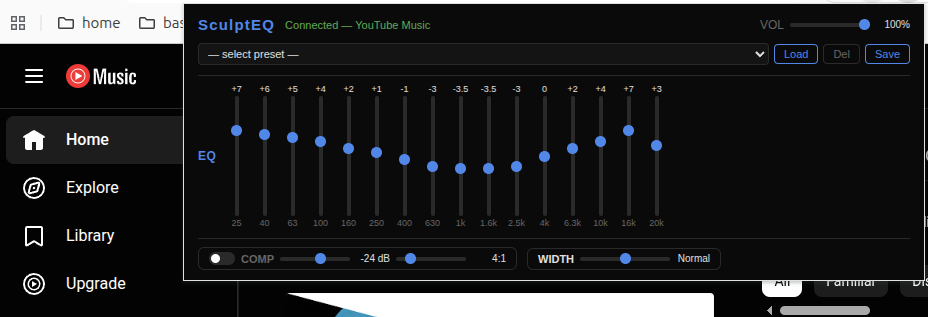

# SculptEQ



A Chrome extension that adds a 16-band parametric EQ, dynamics compressor, and stereo widener to your favourite music streaming services.

**Supported services:** YouTube Music · Spotify · Apple Music · Tidal

---

## Features

- **16-band EQ** — from 25 Hz to 20 kHz, ±15 dB per band
- **Dynamics compressor** — adjustable threshold and ratio
- **Stereo widener** — narrow to wide via mid-side processing
- **Presets** — built-in presets (Flat, Bass Boost, Rock, Pop, Jazz, Classical, Vocal) plus save/load your own
- **Persistent state** — EQ settings are restored automatically when you reopen the popup

## Installation

SculptEQ is not on the Chrome Web Store. Load it manually as an unpacked extension:

1. Clone or download this repository
2. Open Chrome and go to `chrome://extensions`
3. Enable **Developer mode** (top-right toggle)
4. Click **Load unpacked** and select the `sculpteq` folder
5. Open a supported music tab and start playing — the extension icon will show **Connected**

> If you move the folder after loading, repeat steps 4–5.

## Usage

Click the SculptEQ icon in the Chrome toolbar to open the popup.

- **EQ** — drag the band sliders up/down; values are applied in real time
- **Presets** — pick a preset from the dropdown and click **Load**, or dial in your own EQ and click **Save**
- **COMP** — toggle the compressor on/off; adjust threshold (dBFS) and ratio
- **WIDTH** — move the slider left to narrow the stereo image, right to widen it

> After installing or updating the extension, refresh any open music tabs for the DSP chain to activate.

## How it works

SculptEQ injects two content scripts into each supported page:

| Script | World | Role |
|---|---|---|
| `content-dsp.js` | MAIN | Patches `AudioContext` and routes all media audio through the DSP chain |
| `content-bridge.js` | ISOLATED | Relays messages between the popup and the DSP script |

The DSP chain is built entirely with the Web Audio API: 16 `BiquadFilterNode`s in series, followed by a `DynamicsCompressorNode`, a `GainNode` (master volume), and a mid-side stereo widener built from `ChannelSplitter`, `ChannelMerger`, and four `GainNode`s.

## Project structure

```
sculpteq/
├── manifest.json       # MV3 extension manifest
├── popup.html          # Extension popup UI
├── popup.js            # Popup logic (EQ, presets, FX controls)
├── content-dsp.js      # DSP chain — runs in the MAIN world
├── content-bridge.js   # Messaging bridge — runs in the ISOLATED world
└── icons/              # Extension icons (16, 48, 128 px)
```

## License

MIT
